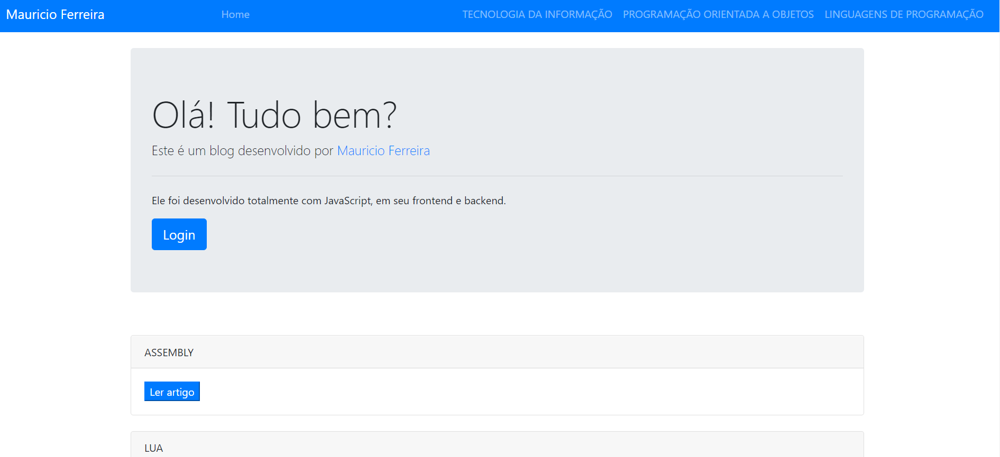

i**PROJETO DE BLOG COM NODDE JS**

*Página inicial do blog*

*Dependencias*

- Express

        npm i --save express

- Express Session

        npm i --save express-session

- Sequelize 

        npm i --save sequelize

- Mysql

        npm i --save mysql2

- Ejs

        npm i --save ejs

- EsLint

        npm init @eslint/config

- Slugify

        npm i --save slugify

- Bcryptjs

        npm i --save bcryptjs

- TinyMCE

    - Baixar em:

        https://www.tiny.cloud/get-tiny/self-hosted/

    - Após o download do arvivo zip, basta colocar a pasta que está dentro do zip na pasta public

- Bootstrap

    - Baixar no site e jogar os arquivos dentro  do projeto (versão 4.5 é usada neste exemplo)
    - Importar o CSS e JS do bootstrap no html

                    <link rel="stylesheet" href="/css/bootstrap.min.css">

    - Para a importação do JS são necessárias duas dependências
    - Os demais CSS, que não forem do bootstrap, devem ser colocados depois do CSS do bootstrap
    - Faz-se a importação das dependências e do arquivo JS do bootstrap
    - A ordem deve ser a exata a seguir de acordo com a versão que estiver sendo utilizada

                    
                    
                    

    *REUTILIZANDO HTML COM PARTIALS*

    - Partes de layouts que podem ser reutilizadas em outras páginas (componentes)
    - Usa-se a função include para chamar o arquivo do componente desejado, apontando a propriedade partials seguido do caminho e nome do arquivo

                    <%- include('partials/header.ejs') %>

*ARQUITETURA DE PASTAS*

- models

    - Camada de manipulação e acesso aos dados
    - Arquivos de conexão com o Banco de Dados e tabelas
    - Arvos de comunicação com APIs de dados

- public

    - Arquivos CSS, EJS, HTML, IMG

- views

    - Camada de interface
    - Arquivos das páginas (HTML/EJS)

- controllers
    
    - Camada de controle
    - Arquivos que guardam as lógicas das rotas
    - Neste projeto, cada ccontroller terá sua pasta, ao invés de permanecerem todos os arquivos em uma única página Controller

*Express Router*

- Ao dividir-se os controllers, usa-se as rotas do express para a construção das rotas

- Após a contrução das rotas,e xporta-se o módulo

                cnst express = require('express');
                const router = express.Router();
                router.get('/categories', (req, res) => {
                    res.send('Rota de categorias');
                });

                module.exports = router;

- No index.js, para a utilização da rota, importa-se o módulo e usa-se app.use()
- Antes da passagem da rota, define-se um prefixo. A rota torna-se acessível somente sendo acessada após o prefixo

                const Categories = require('./categories/categoriesController.js');

                app.use('/cat', Categories);

- Com o prefixo, a rota passa a ser acessada somente por http://localhost:8080/cat/categories
- Para que não haja prefixo, coloca-se apenas uma barra, de form que a rota possa ser acessada somente por http://localhost:8080/categories

*Definição dos models*

- Definir os models que serão utilizados

                const db = require('./db.js');
                const Sequelize = require('sequelize');

                const Article = db.sequelize.define('articles', {
                    title: {
                        type: Sequelize.STRING,
                        allowNull: false
                    },
                    slug: { //TITULO POSSÍVEL DE SER UTILIZADO EM UMA URL
                        type: Sequelize.STRING,
                        allowNull: false
                    },
                    body: {
                        type: Sequelize.TEXT,
                        allowNull: false
                    }
                });

                module.exports = Article;

                const db = require('./db.js');
                const Sequelize = require('sequelize');

                const Category = db.sequelize.define('categories', {
                    title: {
                        type: Sequelize.STRING,
                        allowNull: false
                    },
                    slug: { //TITULO POSSÍVEL DE SER UTILIZADO EM UMA URL
                        type: Sequelize.STRING,
                        allowNull: false
                    }
                });

                module.exports = Category;

*Definição do relacionamento das tabelas*

- Em um dos models, importa-se o model que deseja estabelecer a relação

- Utiliza-se a função belongsTo() na variável do model que está importando, tendo como valor o model importado
    - Desta forma, diz-se que o model que executa a função pertence ao model que está no valor
    - Forma de representar um relacionamento um para um no Sequelize

- Utiliza-se a função hasMany() na variável do model que está sendo importado, tendo como valor o model importando
    - Desta forma, diz-se que o model que executa a função contém o model que está no valor
    - Forma de representar um relacionamento um para para muitos no Sequelize

                const db = require('./db.js');
                const Sequelize = require('sequelize');
                const Category = require('./Category.js');

                const Article = db.sequelize.define('articles', {
                    title: {
                        type: Sequelize.STRING,
                        allowNull: false
                    },
                    slug: { //TITULO POSSÍVEL DE SER UTILIZADO EM UMA URL
                        type: Sequelize.STRING,
                        allowNull: false
                    },
                    body: {
                        type: Sequelize.TEXT,
                        allowNull: false
                    }
                });

                Category.hasMany(Article);
                Article.belongsTo(Category);

                module.exports = Article;

- Sempre que se define um relacionamento, deve ser feita a atualização do Banco de Dados

                Category.sync({force: true});
                Article.sync({force: true});

*Transformando títulos em slugs*

- Utilização da biblioteca Slugify

    - Utiliza-se a função slugify() e passando um valor. O valor na função será convertido para slug

                router.post('/categorires/save', (req, res) => {
                    const title = req.body.title.toUpperCase();

                    if (title.length > 0) {
                        console.log(`Dado: ${title}\ntamanho: ${title.length}`);
                        Category.create({
                            title: title,
                            slug: slugify(title)
                        }).then(() => {
                            res.redirect('/');
                        });
                    } else {
                        res.redirect('/admin/categories/new');
                        console.log('Conteúdo inválido');
                    }
                });

*Exclusão de dados via post*

- A rota verifica se o dado enviado é um numero, pois está sendo referenciado o ID

                router.post('/categories/delete', (req, res) => {
                    var id = req.body.id;

                    if (id.length > 0) {
                        if (!isNaN(id)) {
                            Category.destroy({
                                where: {
                                    id: id
                                }
                            }).then(() => {
                                res.redirect('/admin/categories');
                            });
                        } else {
                            res.redirect('/admin/categories');
                        }
                    } else {
                        res.redirect('/admin/categories');
                    }
                });

- O botão para exclusão é englobado por um form e recebe um input invisível com o valor que deverá ser passado

                <tbody>
                    <% categories.forEach((category) => { %>
                        <tr>
                            <th><%= category.id %></th>
                            <th><%= category.title %></th>
                            <th><%= category.slug %></th>
                            <th>
                                <button class="btn btn-warning person">Editar</button>
                                
                                <form method="POST" action="/categories/delete" class="person">

                                    <input type="hidden" name="id" value="<%= category.id %>">

                                    <button class="btn btn-danger person" type="submit">Excluir</button>

                                </form>
                            </th>
                        </tr>
                    <% }) %>
                </tbody>

*Implementação de confirmação de exclusão*

- Em uma tag  diciona-se uma função dom com evento preventDefault(), que interrompe a submissão do formulário
- Após a interrupção da submissão do relatório, adicionamos a confirmação de exclusão
- A função recebe dois parametro: o primeiro se refere ao evento que está sendo executado (submissão do formulário), o segundo se refere a qual elemento está disparando o evenro (formulário)
- Os parametros devem ser passados em um evendo onsubit="" no formulário html. A referencia ao evento permanece como o nome do parametro, porém a referencia ao elemento html é passada como "this", pois está sendo referenciado no proprio elemento que dispara o evento

                <form method="POST" action="/categories/delete" class="person" onsubmit="confirmDelete(event, this)">

                    <input type="hidden" name="id" value="<%= category.id %>">

                    <button class="btn btn-danger person" type="submit">Excluir</button>
                    
                </form>

                

*Buscando registro por id*

- Utiliza-se a função findByPk()

                router.get('/admin/categories/edit/:id', (req, res) => {
                    let id = req.params.id;

                    if (isNaN(id)){
                        res.redirect('/admin/categories');
                    }

                    Category.findByPk(id).then((category) => {

                        if (id.length > 0) {

                            res.render('admin/categories/edit', {category: category});
                            
                        } else {
                            res.redirect('/admin/categories');
                        }

                    // eslint-disable-next-line no-unused-vars
                    }).catch((err) => {
                        res.redirect('/admin/categories');
                    });
                });

*Utilizando TinyMCE*

- Carrega-se o script do TinyMCE na view que desejamos utilizar

                

- Após a importação do script, adicionamos um ID na textarea que desejamos aplicar as ferramentas e em uma tag script apontamos o id para que sejam adicionadas as funcionalidades

                

- É possível adicionar mais funcionalidades ao TinyMCE através dos plugins

    - Para adicionar novos plugins, basta acrescentar ao script, a propriedade plugins e informar em um array os plugins desejados. Os plugins são informados englobados nas mesmas aspas e são separados por espaços

                

    - Advlist

        - Cria listas
    
    - Autolink

        - Quando um link for copiado e colado no texto, ele será estilizado automaticamente
    
    - link

        - Cria links com botão
    
    - Image

        - Permite adicionar imagens
    
    - Lists

        - Listas simples
    
    - Print

        - Para imprimir o artigo
    
    - Preview

        - Previsualização do que está sendo escrito

    - Hr

        - Adiciona uma linha

    - Searchreplace

        - Para pesquisar utilizando ctrl + f
    
    - Wordcount

        - Informa a quantidade de palavras escritas
    
    - Fullscreen

        - para abrir o editor em tela cheia

    - Insertdatetime

        - Insere a data no texto
    
    - Media

        - Para inserção de midias
    
    - Save

        - Para salvar como um arquivo no pc
    
    - Table

        - Para criar tabelas
    
    - Paste

        - Colagem diferente
    
    - Emoticons

        - Inserir emoticons no post

- Alteração da linguagem do TinyMCE

    - Basta baixar o pacote da lingua desejada em

                https://www.tiny.cloud/get-tiny/language-packages/

    - Após o download do script para tradução, basta colocar o script dentro de tinymce\js\tinymce\langs e após isso, adicionar a propriedade language com o valor da linguagem conforme o nome do arquivo

                

*Join a outra tabela com Sequelize*

- Adiciona-se o parâmetro include à busca, passando um array e dentro do array passa-se um objeto, que possui a propriedade model e o valor será o model da tabela que se deseja realizar o join

                router.get('/admin/articles', (req, res) => {
                    Article.findAll({
                        include: [{model: Category}]
                    }).then((articles) => {
                        res.render('admin/articles/index', {articles: articles});
                    });
                });

- Para renderizar as propriedades do model incluído, basta realizar o acesso na view através de model.modelIncluded.column

                <th><%= article.id %></th>
                <th><%= article.title %></th>
                <th><%= article.slug %></th>
                <th><%= article.category.title %></th>

*Correção de exibição dos artigos*

- Para que os artigos sejam exibidos com a formatação utilizada na produção do artigo implementada, deve ser utilizada a tag especial do ejs com ifen, ao invés do sinal de igual ( <%-%> )

                

                    <%- article.body %>
                

*Paginação*

- Cria-se uma rota com parametro. O parametro indicará o numero da página exibida

- Utiliza-se a função findAndCountAll() do Sequelize para buscar e contar a quantidade de elementos

- Limita-se a quantidade de elementos visualizados através da constraint limit usada como parametro da função

- Utiliza-se o parametro offset para determinar a partir de qual elemento o resultado será exibido

    - Por exemplo: caso o valor do offset seja 10 e o limit 4, serão exibidos os elementos 11, 12, 13 e 14

- Utiliza-se uma estrutura condicional para definir o offset como 0 caso a página seja 1 ou não seja um número

- Foi criada uma variável booleana para verificar se há ou não mais artigos a serem mostrados em mais páginas

                router.get('/articles/page/:num', (req, res) => {
                    let page = req.params.num;
                    let offset = 0;
                    
                    if (isNaN(page) || page == 1) {
                        offset = 0;
                    } else {
                        offset = parseInt(page) * 4;
                    }

                    Article.findAndCountAll({
                        limit: 4,
                        offset: offset
                    }).then((articles) => {

                        let next;

                        if (offset + 4 > articles.count) {
                            next = false;
                        } else {
                            next = true;
                        }
                        
                        let result = {
                            next: next,
                            articles: articles
                        };

                        res.json(result);
                    });
                });

*Exibição dos elementos na rota de paginação*

- O acesso à lista de artigos na paginação deve ser feito através a propriedade row, pois a função findAndCountAll() retorna a lista e o resultado

                <%- include('../../partials/head.ejs') %>

                    <body>
                        <%- include('../../partials/navbarHome.ejs') %>

                            

                                <main>
                                    <% result.articles.rows.forEach((article)=> { %>

                                        

                                            

                                                <%= article.title %>
                                            

                                            

                                                <a href="/<%= article.slug %>"><button class="btn-primary">Ler artigo</button></a>
                                            

                                        

                                    <% }) %>
                                </main>
                            

                    </body>

                <%- include('../../partials/scripts.ejs') %>

*Hash de senha*

- Parecido com a criptografia de senha, porém, a criptografia segue padrões de encriptamento, e esses padrões podem ser feitos de forma inversa para que seja descoberta a senha. No hash, não há essa possibilidade

- Bcrypt

    - Biblioteca para Hash de senha

- A biblioteca de hash será importada no controller no qual terá acesso a senha, neste caso, userController

- Cria-se uma variável *salt* no escopo da rota que recebe a senha, que recebe bcrypt executando a função genSaltSync(10). Esta variável serve para auxiliar no hash da senha.

- Cria-se uma variável que recebe bcrypt.hashSync() tendo como parametro a senha informada pelo usuário e o salt

                router.post('/admin/user/create', (req, res) => {
                    let {email, password} = req.body;
                    let salt = bcrypt.genSaltSync(10);
                    let hash = bcrypt.hashSync(password, salt);

                    User.create({
                        email: email,
                        password: hash
                    }).then(() => {
                        res.redirect('/admin/users');
                    }).catch((err) => {
                        console.log(err);
                    });
                });

*LOGIN*

- Cookies

    - Pequenos arquivos de texto muito simples que ficam armazenados no navegador e guardam informações do usuário

- Sessões

    - Mesma funcionalidade dos Cookies, porém as informações ficam salvas no Servidor

    - Geralmente dependem dos Cookies, mas os dados ficam guardadas no Servidor

    - Uma Sessão é iniciada no Servidor, que envia um Cookie ao browser com um ID único daquela Sessão

    - Qualquer dado associado à sessão é armazenado no Servidor e associado a esse ID

    - Em toda requisição, o browser envia de volta o cookie com o ID da sessão, o que permite ao servidor dar acesso aos dados associados àquele ID

    - Portanto, usar sessões é um pouco mais seguro do que guardar dados diretamente em Cookies, já que se alguém tiver acesso ao Cookie, não tem acesso direto aos dados, além de que, não é possível armazenar muitos dados nos cookies

    - Qualquer dado pode ser salvo em uma sessão. Este dado estará disponível para qualquer rota da aplicação

        - Para que esses dados estejam disponíveis na aplicação será necessário acessar a rota na qual armazena esses dados e passá-los

                req.session.treinamento = 'Node';
                req.session.ano = '2022';
                req.session.email = 'teste@teste.com';
                req.session.user = {
                    username: 'mau',
                    email: 'mau@teste.com',
                    id: 12
                };

- Express Session

    - Biblioteca para trabalhar com sessões no express

    - Necessario realizar a configuração da lib no arquivo index.js fazendo a importação do módulo

    - Possui um Storage

        - Salva os dados na memória do Servidor (dados salvos na memória ram do computador)

            - Não indicado para sistemas de médio e de grande porte, devido à quantidade de requisição

        - Para resolver a questão do salvar os dados no Storage, pode-se utilizar uma ferramenta para salvamento de sessões e cache, como o *Redis*

    - Necessário ativar o gerenciamento de sessões na aplicação através de app.use()

        - Será passado como parametro a variável de imporação do módulo, com os parametros Secret - que recebe uma palavra qualquer para auxiliar na segurança dos dados (recomendado definir algo aleatoreamente) - e cookie - que definirá a forma que seão salvos os cookies no navegador do usuário. Este é um cookie de identificação

        - Necessário passar os parametros resave e saveUninitialized para correção do aviso de depreciação 

        - Podemos passar o parametro maxAge para o cookie, com o objetivo de definir quando ele irá expirar, com o valor tendo de ser passado em ms (milisegundos)

        - Quando o Servidor expira, os dados são apagados

                const session = require('express-session');
                app.use(session({
                    secret: 'mauaplicationsecret',
                    cookie: { maxAge: 30000 },
                    resave: true,
                    saveUninitialized: true
                }));

- Autenticação de login

    - Utilizamos o bcrypt para validar a senha através da função compareSync(), que recebe dois parametros: o primeiro parametro será a senha passada pelo usuário no body, e o segundo será a senha no banco de dados

        - Podemos fazer uma busca pelo email passado no body e, caso encontremos o email, comparar a senha, acessando como um objeto
    
    - Se o usuário for validado, iniciamos uma sessão pegando o email e id do usuário

                router.post('/admin/user/authenticate', (req, res) => {
                    let { email, password } = req.body;

                    User.findOne({
                        where: { email: email }
                    }).then((user) => {
                        if (user != undefined) {
                            let correct = bcrypt.compareSync(password, user.password);

                            if (correct) {
                                req.session.user = {
                                    id: user.id,
                                    email: user.email
                                };
                                res.json(req.session.user);
                            } else {
                                res.redirect('/login');
                            }
                        } else {
                            res.redirect('/login');
                        }
                    }).catch((err) => {
                        console.log(err);
                    });
                });

*Autorização*

- Middlewares

    - Função que fica entre a requisição e a resposta para o usuário

    - Recebe 3 parametros: req, res e next

    - O next irá indicar que deve ser dado continuidade na requisição

                const adminAuth = (req, res, next) => {
                    if (req.session.user != undefined) {
                        next();
                    } else {
                        res.redirect('/');
                    }
                };

                module.exports = adminAuth;

- Definimos por meio de um middleware quem pode ou não acessar as rotas

- Para atribuir o middleware a uma rota, basta passar a função importada do middleware nos parametros da requisição

                const Admin = require('../middlewares/adminAuth');

                router.get('/admin/articles', Admin, (req, res) => {
                    Article.findAll({
                        order: [['id','desc']],
                        include: [{model: Category}]
                    }).then((articles) => {
                        res.render('admin/articles/index', {articles: articles});
                    });
                });